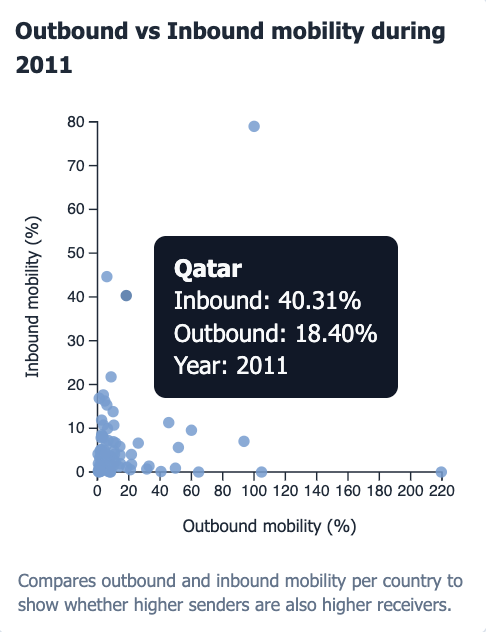
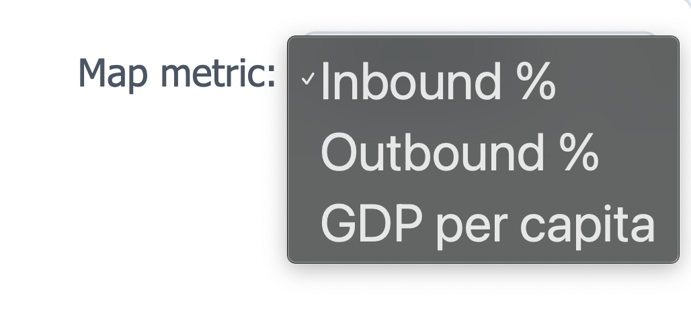
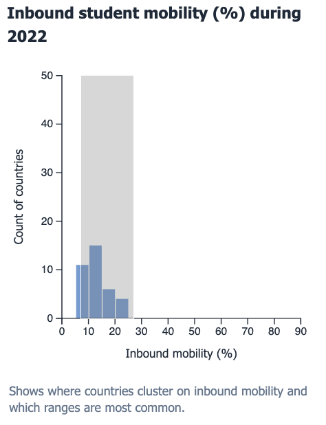
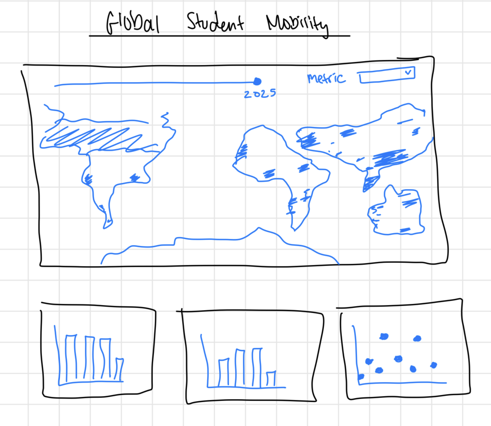

# Global Student Mobility Dashboard

I built this interactive D3 dashboard to explore how countries send and receive international students over time.

I am personally curious about access to education around the world, and I kept coming back to this question: **is studying abroad a global opportunity, or mostly a luxury for a smaller slice of the world, and do high-mobility countries tend to be richer?**

Live site: https://visual-data-project-1.khansfareena.workers.dev/

## Project Overview
For this project, I wanted to look at international education access through a global lens. The core question I explored is: **which countries mostly send students abroad, which countries mostly receive students, and how do those patterns relate to each other?**

I focused on two main metrics:
- `inbound_pct`: share of students from abroad (inbound mobility)
- `outbound_pct`: share of students studying abroad (outbound mobility)

I also added a third metric for context:
- `gdp_per_capita`: GDP per capita (US$)

## About the Data
Data source: **Our World in Data**

- Inbound mobility:
  [Share of students from abroad](https://ourworldindata.org/grapher/share-of-students-from-abroad?mapSelect=USA~ETH~LBY)
- Outbound mobility:
  [Share of students studying abroad](https://ourworldindata.org/grapher/share-of-students-studying-abroad?mapSelect=ARE~NER~DZA)
- GDP context file:
  `data/gdp-per-capita-worldbank.csv` (World Bank series via OWID grapher export)

Map geometry:
- `world.geojson` from D3 Graph Gallery:
  https://raw.githubusercontent.com/holtzy/D3-graph-gallery/master/DATA/world.geojson

### Data preprocessing
I downloaded the CSV files and merged them by country code + year (`Code`, `Year`) using Python scripts.

- `scripts/merge_student_mobility_data.py`
  - merges inbound and outbound data
- `scripts/build_student_mobility_plus_gdp.py`
  - appends GDP per capita values

Final dataset used by the app:
- `data/student-mobility-merged-plus-gdp.csv`

Current data coverage in this build:
- 2,148 country-year rows
- Years: 1998-2022
- 101 countries in the 2022 view

## Visualization Components
I organized the dashboard into four linked views:

1. **Choropleth world map**
   - Metric toggle: inbound %, outbound %, GDP per capita
   - Year slider (1998-2022)
   - Legend + hover tooltip

2. **Inbound histogram**
   - Distribution of inbound mobility values
   - Hover tooltip with bin range and count

3. **Outbound histogram**
   - Distribution of outbound mobility values
   - Hover tooltip with bin range and count

4. **Scatterplot (Outbound vs Inbound)**
   - Country-level correlation view
   - Hover tooltip with country + both metrics

## Interaction Design
### 1) Hover tooltip
- Map: country name, inbound/outbound/GDP, year
- Histograms: value range in the bin + number of countries
- Scatterplot: country name + x/y values

### 2) Changing metric + year
- I use the map dropdown to switch the displayed metric
- The year slider updates all views together

### 3) Brushing + linking
- Brush mode can be toggled on/off
- Histograms support horizontal range brushing
- Scatterplot supports rectangular brushing
- Multiple brushes are combined with **intersection**
- All views update to the active brushed set
- `Clear brushed selection` resets everything

## Findings
Some patterns I observed while exploring the data:

1. Mobility appears highly unequal: in most years, the distributions are right skewed, meaning a small set of countries accounts for much of the high inbound or outbound activity while many countries stay near the low end.
2. Countries do not split neatly into "senders" or "receivers." The scatter shows many mixed profiles, including countries with moderate outbound but low inbound, which suggests participation in global education is often one-directional rather than balanced.
3. High GDP per capita often overlaps with stronger inbound mobility, but not perfectly. Some wealthy countries remain less prominent destinations, and some non-top-GDP countries still attract meaningful inbound shares, suggesting policy, language, and regional networks likely matter alongside income.
4. The map and histograms together make concentration visible: regional clusters appear in destination-heavy areas, while larger parts of the map remain consistently light across years, pointing to persistent access gaps rather than short-term fluctuation.
5. Year changes suggest uneven momentum. Some countries move quickly in the distributions while others remain structurally stable, which raises a key question: who is actually gaining new access to international education over time, and who is being left behind?

These are exploratory findings from the visual patterns I observed, not causal claims.

## Design Choices
I intentionally kept this as a one-page dashboard layout (even though it was difficult at first) so related views stay visible together and comparisons feel more natural.

Color decisions:
- neutral page/card colors for readability
- sequential blue palette for quantitative encoding
- light gray tones for missing or filtered-out map values

These are continuous quantitative variables, so I used sequential scales to represent low-to-high magnitude in a way that is intuitive and consistent across views. I kept non-data UI colors muted so color contrast is mainly used for the data itself, which improves scanability and reduces visual noise. I originally tried a green color scale for GDP, but changed it because that choice could be harder to interpret for some color-blind users and made cross-metric comparison less accessible.

## Creation Process
Here's my initial sketch, which I used as a guide pretty closely.

### Libraries / tools I used
- HTML, CSS, JavaScript (ES modules)
- D3.js v7 (via jsDelivr CDN)
- Python 3 for preprocessing scripts
- Cloudflare Workers for deployment

### Code structure
- `index.html`: layout, text, controls, chart containers
- `style.css`: page layout and styling
- `js/main.js`: state management, data loading, linked updates
- `js/map.js`: choropleth map rendering + legend + metric switching
- `js/histogram.js`: histogram rendering + brush logic
- `js/scatter.js`: scatterplot rendering + brush logic
- `js/chart-utils.js`: shared chart and tooltip helpers

## How to Run Locally
1. Start a local server from the repo root:
   - `python3 -m http.server 8000`
2. Open:
   - `http://localhost:8000`

## Challenges and Future Work
### Challenges
- Fitting all visualizations and controls into one single-page view was harder than I expected. I wanted everything visible without scrolling, but still readable and balanced, so I had to iterate on spacing and sizing a lot.
- Matching country rows to map features took extra care (ISO-3 first, normalized name fallback).
- Keeping linked brushing stable across multiple charts required careful shared state and redraw logic.
- Finding the right color scale took trial and error, especially when trying to keep the map readable and accessible across different metrics.
- Tuning the map legend gradient bar was also unexpectedly tricky. Small adjustments to the gradient stops, labels, and range mapping made a big difference in how accurate and clear the color encoding felt.
- Missing GDP values needed clean handling so tooltips and map coloring did not break.

### Future work
- Add richer time analysis (animation or selected-country trend lines).
- Add regional filters and lightweight annotation/storytelling mode.
- Build a true origin-destination connection spider map type of interaction. I originally wanted users to hover one country and highlight exactly where students come from or go to, but my current OWID inputs only provide one aggregated inbound % and outbound % per country-year. To make that interaction real, I would source bilateral flow data (origin, destination, year, count), reshape it into country-pair links, and then connect a hover action to highlighted route lines and partner-country tooltips.

## AI and Collaboration
I used AI tools for debugging, code cleanup, and documentation drafting. I also used autocomplete often for repetitive code, and discussed my data and different design/analysis options with it while deciding next steps. I still reviewed and integrated those parts manually, and all final implementation decisions were mine.

## Demo Video
[Watch the demo video](./media/demo.mp4)
